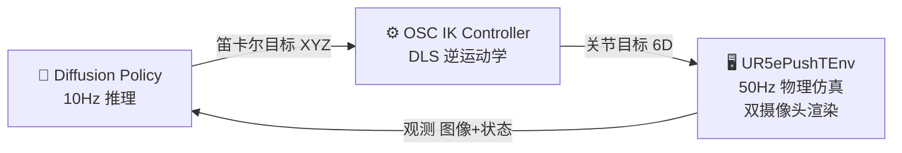

# UR5e Push-T Diffusion Policy

基于 **MuJoCo 物理仿真** 和 **扩散策略 (Diffusion Policy)** 的 UR5e 机械臂 Push-T 任务端到端视觉运动模仿学习系统。

## 📋 项目概述

控制 UR5e 协作机械臂在桌面环境中将 T 形块推动到随机目标位置。系统采用端到端的视觉模仿学习范式：从双摄像头 RGB 图像直接预测机器人关节动作，无需手工设计控制器。

### 核心特性

- **双摄像头视觉系统**：全局俯视相机 (Overhead) + 手腕随动相机 (Wrist)，256×256 RGB
- **三种数据收集方式**：基于规则的 FSM 专家、键盘遥操作、SO101 UDP 遥操作
- **标准化数据管道**：.npz 原始数据 → Zarr 结构化数据集
- **两种部署模式**：同步动作分块执行 / 异步多线程生产者-消费者
- **6-DOF 逆运动学**：阻尼最小二乘法 (DLS)，同时约束位置和姿态

### 技术栈

| 组件 | 技术 |
|------|------|
| 物理引擎 | MuJoCo |
| 环境接口 | Gymnasium |
| 深度学习 | PyTorch + Diffusion Policy |
| 数据存储 | Zarr (分块压缩) |
| 逆运动学 | OSC DLS (6-DOF) |
| 遥操作 | pynput 键盘 / UDP Socket |

---

## 📁 目录结构

```
ur5e_pusht_dp_Ge/
├── main.py                          # 入口: 自动专家数据收集
├── deploy_model.py                  # 同步扩散策略推理部署
├── deploy_async_ensembling.py       # 异步多线程部署 + EMA 平滑
├── test_scene.py                    # 最小化 MuJoCo 场景渲染测试
├── requirements.txt                 # Python 依赖列表
│
├── configs/                         # 配置文件 (待完善)
│   ├── env_config.yaml
│   └── train_config.yaml
│
├── envs/                            # 环境模块
│   ├── ur5e_pusht_env.py            # Gymnasium 环境 (双摄像头)
│   └── assets/
│       ├── ur5e_scene.xml           # 主 MuJoCo 场景 (桌子/T块/相机)
│       └── ur5e/                    # UR5e 机器人 MJCF 定义 + 网格文件
│           └── ur5e.xml             # 运动学链 + 推杆 + 腕部相机
│
├── control/                         # 控制模块
│   ├── osc_controller.py            # 6-DOF IK 控制器 (位置 + 姿态)
│   └── kinematics.py                # [存根] 运动学工具
│
├── data_collection/                 # 数据收集模块
│   ├── scripted_expert.py           # 多段闭环 FSM 基于规则专家
│   ├── teleop_keyboard.py           # 键盘遥操作 (含录制)
│   ├── teleop_so101.py              # SO101 UDP 遥操作类
│   ├── teleop_mujoco_so101.py       # SO101 遥操作主循环
│   └── record_utils.py              # [存根] 录制辅助工具
│
├── dataset/                         # 数据集模块
│   ├── zarr_builder.py              # 纯状态 .npz → .zarr 打包
│   ├── vision_zarr_builder.py       # 视觉 .npz → .zarr 打包 (双图像)
│   ├── visualize_zarr.py            # 并排双摄像头 Zarr 可视化回放
│   ├── tune_camera.py               # 交互式腕部相机参数调参器
│   ├── dataloader.py                # [存根] PyTorch 数据加载器
│   ├── raw/                         # 40 个原始专家演示 (.npz)
│   ├── pusht_ur5e.zarr/             # 已构建纯状态 Zarr 数据集
│   └── pusht_ur5e_vision.zarr/      # 已构建视觉 Zarr 数据集
│
├── policy/                          # 策略模块 (待完善)
│   ├── diffusion_unet.py            # [存根] 扩散 UNet 模型定义
│   └── train.py                     # [存根] 训练循环
│
├── eval/                            # 评估模块 (待完善)
│   └── rollout.py                   # [存根] 评估/rollout 脚本
│
└── checkpoints/
    └── latest.ckpt                  # 已训练扩散策略权重
```

---

## 🔄 系统数据流程图

```mermaid
flowchart TB
    subgraph DC["① 数据收集"]
        A1["⌨️ 键盘遥操作"]
        A2["🎮 SO101 UDP 遥操作"]
        A3["🤖 FSM 基于规则专家"]
    end

    subgraph RAW["② 原始数据"]
        B1["dataset/raw/episode_XXXX.npz ×40"]
    end

    subgraph PACK["③ 数据打包"]
        C1["zarr_builder.py\n纯状态: state(9)+action(3)"]
        C2["vision_zarr_builder.py\n视觉: img×2+state(6)+action(3)"]
    end

    subgraph ZARR["④ Zarr 数据集"]
        D1["pusht_ur5e.zarr"]
        D2["pusht_ur5e_vision.zarr"]
    end

    subgraph TRAIN["⑤ 扩散策略训练"]
        E1["CNN Encoder + Diffusion UNet\n外部 diffusion_policy 库"]
    end

    subGRAPH CKPT["⑥ 检查点"]
        F1["checkpoints/latest.ckpt"]
    end

    subgraph DEPLOY["⑦ 模型部署"]
        G1["deploy_model.py\n同步模式 动作分块"]
        G2["deploy_async_ensembling.py\n异步模式 生产者-消费者"]
    end

    subgraph CTRL["⑧ 控制执行"]
        H1["OSC IK Controller\nXYZ → 6关节角度"]
        H2["UR5ePushTEnv (MuJoCo)\n50Hz 双摄像头渲染"]
    end

    A1 & A2 & A3 --> B1
    B1 --> C1 & C2
    C1 --> D1
    C2 --> D2
    D1 & D2 --> E1
    E1 --> F1
    F1 --> G1 & G2
    G1 & G2 --> H1
    H1 --> H2
    H2 -.->|"观测反馈 10Hz"| G1
    H2 -.->|"观测反馈 10Hz"| G2
```

---

## 🧠 策略推理控制闭环



---

## 📖 文件详解

### 环境模块 (`envs/`)

#### `envs/ur5e_pusht_env.py` — Gymnasium 环境

实现标准的 `gymnasium.Env` 接口，封装 MuJoCo 物理仿真和双摄像头渲染。

| 项目 | 说明 |
|------|------|
| **动作空间** | `Box(low=-π, high=π, shape=(6,))` — 6 个关节目标角度 |
| **观测空间** | `dict`: `qpos`(6D) + `t_cube_pos`(3D) + `image_overhead`(256²) + `image_wrist`(256²) |
| **仿真频率** | 50Hz 物理步进，每 `step()` 执行 25 子步 |
| **域随机化** | T 形块随机 XY 位置 + 360° 随机 Yaw 角 + 关节初始噪声 (±0.05rad) |

**关键实现：**

```python
# reset() - 域随机化初始化
t_x = np.random.uniform(0.45, 0.65)           # X 范围
t_y = np.random.uniform(-0.2, 0.2)            # Y 范围
rand_yaw = np.random.uniform(-np.pi, np.pi)   # 全角度随机

# 纯数学手解绕 Z 轴旋转四元数 (避免 transforms3d 坐标轴错位)
qw = np.cos(rand_yaw / 2.0)
qz = np.sin(rand_yaw / 2.0)
quat = [qw, 0.0, 0.0, qz]

# step() - 25子步 (0.5s 物理时间)
self.data.ctrl[:6] = action
for _ in range(25):
    mujoco.mj_step(self.model, self.data)

# _get_obs() - 双摄像头渲染
self.renderer.update_scene(self.data, camera="overhead_cam")
img_overhead = self.renderer.render()  # (256, 256, 3) uint8
self.renderer.update_scene(self.data, camera="wrist_cam")
img_wrist = self.renderer.render()
```

---

#### `envs/assets/ur5e_scene.xml` — 主场景定义

MuJoCo XML 场景文件，定义完整的仿真世界：

| 元素 | 描述 |
|------|------|
| **UR5e 机器人** | 通过 `<include>` 引入 `ur5e/ur5e.xml` |
| **工作台** | 0.4×0.4×0.02m，位于 (0.6, 0, 0.4) |
| **T 形块** | 两个正交 box geom (0.12×0.12×0.04m)，自由关节驱动 |
| **目标指示器** | 绿色半透明区域，无碰撞体积 |
| **Overhead 相机** | 固定 (0.6, 0, 1.7)，朝下俯视，fovy=60° |

#### `envs/assets/ur5e/ur5e.xml` — UR5e 机器人模型

上游 MJCF 模型（BSD-3 许可证），包含完整运动学链、6 个位置控制致动器、推杆工具（视觉+碰撞+IK 跟踪点）、腕部相机。

---

### 控制模块 (`control/`)

#### `control/osc_controller.py` — 6-DOF 逆运动学控制器

实现**操作空间控制 (Operational Space Control)** 的阻尼最小二乘法 IK。

**数学公式：**

```
误差:  error = [pos_error(3D), rot_error(3D)]
雅可比: J = [J_pos; J_rot]  ∈ R^(6×6)
增量:  Δq = Jᵀ · (J·Jᵀ + λ²I)⁻¹ · error
```

**关键代码：**

```python
class IKController:
    def __init__(self, model, data, site_name="attachment_site", damping=0.05):
        self.site_id = mujoco.mj_name2id(model, mujoco.mjtObj.mjOBJ_SITE, site_name)
        self.damping = damping  # λ: 阻尼因子，保证数值稳定性

    def sync_target_orientation(self):
        """锁定推杆当前朝下姿态为 IK 目标朝向"""
        self.target_xmat = self.data.site_xmat[self.site_id].copy().reshape(3, 3)

    def calculate_joint_targets(self, target_pos, current_qpos):
        # 1. 位置误差 (3D)
        error_pos = target_pos - self.data.site_xpos[self.site_id]

        # 2. 旋转误差 (3D) — 轴向叉乘逼近
        error_rot = 0.5 * (
            cross(R_curr[:,0], R_target[:,0]) +
            cross(R_curr[:,1], R_target[:,1]) +
            cross(R_curr[:,2], R_target[:,2])
        )

        # 3. DLS 伪逆求解
        J = np.vstack([J_pos, J_rot])  # (6, 6)
        delta_q = J.T @ inv(J @ J.T + λ²I) @ error
        return current_qpos[:6] + delta_q
```

---

### 数据收集模块 (`data_collection/`)

#### `data_collection/scripted_expert.py` — 基于规则 FSM 专家

多段闭环推击有限状态机，通过 `LIFT → APPROACH → DESCEND → PUSH` 循环完成任务。

```
状态转换图:
  LIFT ──(达到高度, 距离<2cm)──▶ DONE
  LIFT ──(达到高度, 距离>=2cm)─▶ APPROACH
  APPROACH ──(到达起点)────────▶ DESCEND
  DESCEND ──(到达高度)─────────▶ PUSH
  PUSH ──(完成推程)────────────▶ LIFT (重新规划)
```

**关键设计：**
- **闭环重规划**：每次推击后回到 LIFT，重新评估 T 型块位置
- **起点偏移**：从 T 型块后方 6cm 处开始，避免碰撞
- **行程限制**：每次最多推 5cm，防止失控滑走
- **完成阈值**：T 型块距离目标 < 2cm 即判定 DONE

```python
# 核心规划逻辑
if self.state == 'APPROACH' and self.start_xy is None:
    push_vec = self.target_pos - t_cube_xy
    push_dir = push_vec / np.linalg.norm(push_vec)
    self.start_xy = t_cube_xy - push_dir * 0.06  # 物块后方6cm
    stroke_len = min(dist + 0.02, 0.05)          # 最大5cm行程
    self.end_xy = t_cube_xy + push_dir * stroke_len
```

#### `data_collection/teleop_keyboard.py` — 键盘遥操作

通过 `pynput` 全局键盘监听实现遥操作控制：

| 按键 | 功能 |
|------|------|
| ↑↓ | X 轴前后移动 |
| ←→ | Y 轴左右移动 |
| PageUp/PageDown | Z 轴升降 |
| Enter | 开始/停止录制 |
| Backspace | 重置环境 |

**录制流程：** Enter 开始 → 10Hz 记录 `{obs, action}` → Enter 结束自动保存 `.npz` → 支持断点续录

#### `data_collection/teleop_mujoco_so101.py` — SO101 UDP 遥操作

UDP 端口 5005 接收 JSON 数据：`{"pan", "lift", "elbow", "gripper"}`。夹爪值 > 50 激活遥操作，角度增量映射为 XYZ 坐标增量。

---

### 数据集模块 (`dataset/`)

#### `dataset/zarr_builder.py` — 纯状态 Zarr 打包

将零散 `.npz` 打包为标准 `.zarr` 格式：

```
pusht_ur5e.zarr/
├── data/
│   ├── state   (N, 9)  float32  ← concat[qpos(6), t_cube_pos(3)]
│   └── action  (N, 3)  float32  ← 3D 笛卡尔目标
└── meta/
    └── episode_ends  (num_episodes,)  int64
```

#### `dataset/vision_zarr_builder.py` — 视觉 Zarr 打包

将含双摄像头图像的 `.npz` 打包为视觉 Zarr 格式：

```
pusht_ur5e_vision.zarr/
├── data/
│   ├── img_overhead  (N, 256, 256, 3)  uint8   ← chunks=(100,...)
│   ├── img_wrist     (N, 256, 256, 3)  uint8
│   ├── state         (N, 6)  float32   ← 仅关节角度(不含T块位置)
│   └── action        (N, 3)  float32
└── meta/
    └── episode_ends  (num_episodes,)  int64
```

> **设计决策**：T 形块位置不放入 `state`，模型应直接从图像中感知 T 型块位置。

#### `dataset/visualize_zarr.py` — 数据集可视化

OpenCV 并排视频播放器：左侧 overhead + 右侧 wrist。空格暂停/继续，Q 退出，每集结束自动停顿 1 秒。

#### `dataset/tune_camera.py` — 相机调参器

交互式腕部相机参数调参工具，实时微调并打印 XML 相机配置片段。

---

### 部署模块 (根目录)

#### `main.py` — 自动专家数据采集入口

整合环境 + IK 控制器 + FSM 专家的完整数据采集管道：

```
循环 (50Hz 物理, 10Hz 记录):
  1. expert.get_action(obs, ee_pos) → 笛卡尔目标 XYZ
  2. ik_controller.calculate_joint_targets() → 关节目标
  3. env.step(cmd_qpos) → 新观测 + 双摄像头渲染
  4. 每5步记录一帧 {obs, action}
  5. expert.state == 'DONE' → 保存剧集 → 重置
```

#### `deploy_model.py` — 同步部署 (动作分块)

加载检查点，执行实时推理控制：

```
观察历史缓冲(N帧) → policy.predict_action() → 动作块(horizon, 6)
    → 执行前 n_action_steps 步 (典型: 预测16步, 执行8步)
    → 盲走期间不推理 → 重新观测 → 再次推理
```

**动作平滑**：在 50 子步上线性插值 `α ∈ [0, 1]`

#### `deploy_async_ensembling.py` — 异步多线程部署

**生产者-消费者架构**：

```
┌── 主线程 (50Hz) ──────────┐    ┌── 推理线程 (10Hz) ──────┐
│  ① MuJoCo 物理 + 渲染      │    │  ① 获取共享观测          │
│  ② 发布观测到共享内存 ─────┼───→│  ② 图像预处理 (归一化)   │
│  ③ 检查新轨迹 ←───────────┼──←─│  ③ policy.predict_action()│
│  ④ EMA 平滑 (α=0.6)       │    │  ④ 发布轨迹到共享内存    │
│  ⑤ 执行动作 (80%+20%混合)  │    └─────────────────────────┘
└───────────────────────────┘
```

**线程安全机制：**
```python
shared_data_lock = threading.Lock()
shared_latest_obs = None        # 主线程发布, 推理线程消费
shared_new_trajectory = None    # 推理线程发布, 主线程消费
```

**EMA 平滑公式：**
```python
smoothed = (1 - α) * prev_smoothed + α * raw_prediction  # α = 0.6
```

#### `test_scene.py` — 场景验证

最小化 MuJoCo 场景加载测试，用于验证环境配置正确。

---

### 待完善模块 (存根)

| 文件 | 计划功能 |
|------|----------|
| `policy/diffusion_unet.py` | 扩散 UNet 网络结构 (CNN Encoder + UNet Decoder) |
| `policy/train.py` | 训练循环 (DataLoader + 扩散过程 + 损失优化) |
| `eval/rollout.py` | 评估脚本 (成功率 + 轨迹可视化) |
| `dataset/dataloader.py` | PyTorch Dataset/DataLoader 封装 |
| `control/kinematics.py` | 正向/逆向运动学辅助工具 |
| `data_collection/record_utils.py` | 录制数据格式转换工具 |
| `configs/` | 环境/训练超参数集中配置 |

> **注意**：实际的扩散策略模型定义和训练逻辑位于外部代码库，通过 `sys.path.append('../diffusion_policy')` 导入。核心入口类为 `TrainDiffusionUnetImageWorkspace`。

---

## 🚀 快速开始

### 环境安装

```bash
pip install -r requirements.txt
pip install transforms3d pynput opencv-python
```

### 测试场景

```bash
python test_scene.py
```

### 自动数据收集 (FSM 专家)

```bash
python main.py
# → dataset/raw/episode_XXXX.npz
```

### 键盘遥操作数据收集

```bash
python data_collection/teleop_keyboard.py
```

### 构建 Zarr 数据集

```bash
python dataset/zarr_builder.py          # 纯状态版本
python dataset/vision_zarr_builder.py   # 视觉版本
```

### 可视化数据集

```bash
python dataset/visualize_zarr.py
```

### 部署推理

```bash
python deploy_model.py                  # 同步模式
python deploy_async_ensembling.py       # 异步模式
```

---

## 📐 关键数据维度速查

| 数据项 | 维度 | 类型 | 说明 |
|--------|------|------|------|
| 关节角度 | (6,) | float32 | shoulder_pan/lift, elbow, wrist_1/2/3 |
| T 块位置 | (3,) | float32 | 世界坐标系 XYZ |
| Overhead 图像 | (256, 256, 3) | uint8 | 全局俯视 RGB |
| Wrist 图像 | (256, 256, 3) | uint8 | 手腕随动 RGB |
| 笛卡尔动作 | (3,) | float32 | 末端执行器 XYZ 目标 |
| 关节动作 | (6,) | float32 | 6 关节目标角度 |
| 纯状态 state | (9,) | float32 | concat[qpos(6), t_pos(3)] |
| 视觉 state | (6,) | float32 | 仅 qpos(6) |

---

## 🔑 核心设计决策

1. **双摄像头互补**：全局相机提供场景感知，腕部相机提供精细操作视角
2. **视觉隐式感知**：不显式输入 T 型块位置，迫使模型从图像中学习空间关系
3. **动作分块执行**：预测 16 步执行 8 步，平衡推理延迟与动作连贯性
4. **异步解耦**：推理线程(10Hz)与控制线程(50Hz)分离，互不阻塞
5. **闭环重规划**：FSM 专家每次推击后重新评估位置，克服物块旋转滑移
6. **内存安全**：剧集完成后立即落盘并清空内存，防止图像数据累积

---

## 📝 版本记录

| 日期 | 更新 |
|------|------|
| 2026-05 | 初始版本：环境搭建、数据收集、模型部署完整工具链 |
| 待完成 | 训练流程、网络定义、评估脚本、配置文件 |
